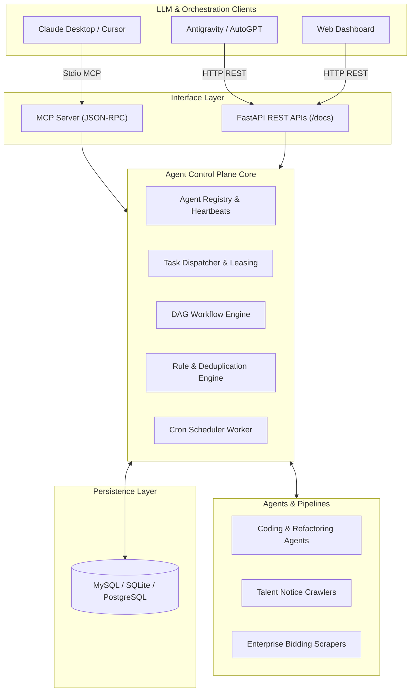

<div align="center">

# 🚀 Agent Control

**Modern, High-Performance Control Plane & Task Orchestration Platform for Autonomous AI Agents**

[](LICENSE)
[](https://www.python.org/)
[](https://fastapi.tiangolo.com)
[](https://modelcontextprotocol.io)
[](docker-compose.yml)
[](CONTRIBUTING.md)

[English](#features) | [中文说明](#agent-control-控制面平台-中文文档)

</div>

---

## 🌟 Highlights

**Agent Control** is a production-grade, asynchronous AI Agent Control Plane and orchestration engine designed to manage autonomous agents, distributed task dispatching, heartbeat leasing, DAG workflow execution, and data collection pipelines at scale.

- ⚡ **Asynchronous & High-Performance**: Built on **FastAPI**, **Uvicorn**, and **SQLAlchemy 2.0**.
- 🤖 **Agent Lifecycle & Heartbeat Leasing**: Distributed state machine with capability matching, automatic lease expiration, and dead-agent eviction.
- 🔀 **DAG Workflow Engine**: Define multi-stage agent graphs with node dependencies, parallel execution, and conditional branches.
- 🔌 **Native MCP (Model Context Protocol) Server**: Connect directly to **Claude Desktop**, **Antigravity**, **Cursor**, or custom LLM apps via standardized JSON-RPC stdio tools.
- 📊 **Real-time Observability Dashboard**: Out-of-the-box responsive web dashboard for agent monitoring, task states, crawl runs, and metrics.
- 🕷️ **Production Crawl & Ingestion Pipelines**: Integrated scrapers (e.g., government talent qualification announcements, enterprise tender data) with built-in deduplication, HTML cleaning, and structured normalization.
- 💾 **Multi-Database Support**: Zero-config **SQLite** for rapid local prototyping; **MySQL** and **PostgreSQL** for enterprise production deployments.

---

## 🏗️ Architecture



---

## ⚡ Quickstart

### Option 1: One-Click Launch (Recommended)

```bash
# Clone the repository
git clone https://github.com/loulanyue/agent-control.git
cd agent-control

# Run with local environment (auto creates venv & installs dependencies)
./start.sh
```

Visit the services:
- **Interactive Dashboard**: [http://localhost:8000/dashboard](http://localhost:8000/dashboard)
- **API Documentation (Swagger UI)**: [http://localhost:8000/docs](http://localhost:8000/docs)
- **Health Check**: [http://localhost:8000/health](http://localhost:8000/health)

### Option 2: Docker Compose

Launch the complete stack (FastAPI + MySQL 8.0) with a single command:

```bash
docker-compose up -d
```

### Option 3: Manual Installation (Python 3.10+)

```bash
python3 -m venv venv
source venv/bin/activate
pip install -r requirements.txt

# Copy environment configuration
cp .env.example .env

# Run FastAPI server
uvicorn main:app --host 0.0.0.0 --port 8000 --reload
```

---

## 🐍 Python SDK (`agent-control-sdk`)

Agent Control includes an official, fully-typed Python SDK for programmatic task dispatching, agent fleet management, and DAG monitoring:

```bash
# Install directly from the repository
pip install -e .
```

### SDK Quickstart

```python
from agent_control_sdk import AgentControlClient, TaskPriority

# 1. Connect to the Control Plane
client = AgentControlClient(base_url="http://localhost:8000")

# 2. Inspect cluster metrics
metrics = client.system.metrics()
print(f"Agents: {metrics.total_agents} | Tasks: {metrics.total_tasks}")

# 3. List online agents
agents = client.agents.list(status="online")
for agent in agents["items"]:
    print(f"Agent: {agent.name} ({agent.agent_type})")

# 4. Dispatch an autonomous task
task = client.tasks.dispatch(
    title="Extract semiconductor job profiles",
    objective="Crawl top 20 chip design companies and normalize skill requirements",
    priority=TaskPriority.HIGH
)
print(f"Dispatched Task #{task.id} (Public ID: {task.public_id})")

# 5. Inspect DAG workflows
graphs = client.graphs.list()
print(f"Active DAG definitions: {graphs['total']}")
```

---

## 🔌 Model Context Protocol (MCP) Integration (10 Built-in Tools)

Agent Control includes a native Model Context Protocol (MCP) server (`mcp_server.py`) enabling LLMs (Claude Desktop, Cursor, Claude Code) to orchestrate tasks, inspect workflows, and query database state.

### 10 Standardized MCP Tools:
- **`control_list_agents`**: Query active AI agents, status, and capabilities.
- **`control_list_tasks`**: Query task execution queue by status, priority, and keyword.
- **`control_dispatch_task`**: Dispatch a new autonomous task into the control plane queue.
- **`control_get_task_status`**: Retrieve execution logs, attempts, and artifacts of a task.
- **`control_list_graphs`**: List DAG workflow pipelines and orchestration topologies.
- **`control_get_system_metrics`**: Get real-time cluster health and operational stats.
- **`mysql_read_query`**: Safe read queries (SELECT / SHOW / DESCRIBE) against backend data.
- **`mysql_list_tables`**: List all 40 system and business data tables.
- **`mysql_describe_table`**: Inspect column definitions and indices of any table.
- **`mysql_execute_statement`**: Execute transactional DML statements.

### Claude Desktop Configuration
Add the following to your `claude_desktop_config.json`:

```json
{
  "mcpServers": {
    "agent-control": {
      "command": "python3",
      "args": ["/path/to/agent-control/mcp_server.py"],
      "env": {
        "DB_HOST": "127.0.0.1",
        "DB_PORT": "13306",
        "DB_USER": "root",
        "DB_PASSWORD": "",
        "DB_NAME": "agent_control"
      }
    }
  }
}
```

---

## 🛠️ Management CLI Commands

`start.sh` provides convenient lifecycle commands:

| Command | Description |
|---|---|
| `./start.sh` | Run in foreground dev mode with live reload |
| `./start.sh start` | Run as background daemon process |
| `./start.sh stop` | Gracefully stop the running daemon |
| `./start.sh restart` | Restart the background service |
| `./start.sh status` | Check service PID, port status, and healthcheck |
| `./start.sh logs` | Follow live daemon logs (`tail -f`) |

---

## 📚 REST API Overview

| Endpoint | Method | Description |
|---|---|---|
| `/api/v1/agents/register` | `POST` | Register a new agent with capabilities |
| `/api/v1/agents/{id}/heartbeat` | `POST` | Refresh agent lease and report status |
| `/api/v1/tasks` | `POST` | Dispatch a new task to the queue |
| `/api/v1/tasks/claim` | `POST` | Agent claims an eligible pending task |
| `/api/v1/graphs` | `POST` | Create a DAG multi-agent workflow |
| `/api/v1/graphs/{id}/trigger` | `POST` | Trigger execution of a workflow |
| `/api/v1/rules` | `GET` | Retrieve and evaluate agent rules |

Explore all endpoints with interactive testing at `http://localhost:8000/docs`.

---

<div id="agent-control-控制面平台-中文文档">

## 📖 Agent Control 控制面平台 (中文说明)

**Agent Control** 是一个专为智能体集群与自动化流水线设计的生产级控制面系统。

### 核心特性
1. **多 Agent 状态机与租约机制**：支持分布式心跳汇报、任务租约锁定、超时自动转移与故障驱逐。
2. **DAG 图工作流编排**：支持定义包含依赖关系的多步骤图任务，实现跨 Agent 协作。
3. **原生 MCP 协议支持**：内置 `mcp_server.py`，支持直接与 Claude Desktop、Cursor 等客户端通过标准工具协议对话。
4. **统一可观测看板**：开箱即用可视化面板（`/dashboard`），实时监控采集作业、任务生命周期及集群指标。
5. **开箱即用**：支持 SQLite 极速体验，支持 MySQL/PostgreSQL 生产环境部署，提供完善的 Docker 与运维脚本。

</div>

---

## 🌐 Ecosystem & Integrations

Agent Control is designed to seamlessly interoperate with the broader agent and developer tooling ecosystem:

- 🏄 **[Dream XI AI](https://github.com/loulanyue/dream-xi-ai)** (460+ ⭐): Multi-Agent Collaboration Platform inspired by football dream team formations. Uses Agent Control as its distributed control plane and scheduling engine.
- 📚 **[Awesome Claude Notes](https://github.com/loulanyue/awesome-claude-notes)** (270+ ⭐): Community-maintained repository of reusable AI coding agents, skills, and workflows with out-of-the-box MCP integration.
- 🎯 **[Spec Kit ZH](https://github.com/loulanyue/spec-kit-zh)** (330+ ⭐): Spec-driven development toolkit for Claude Code, Cursor, and Codex agents.

---

## 🤝 Contributing

Contributions, bug reports, and feature requests are very welcome! Please check our [Contributing Guide](CONTRIBUTING.md) and [Code of Conduct](CODE_OF_CONDUCT.md).

## 📄 License

This project is licensed under the Apache 2.0 License - see the [LICENSE](LICENSE) file for details.
